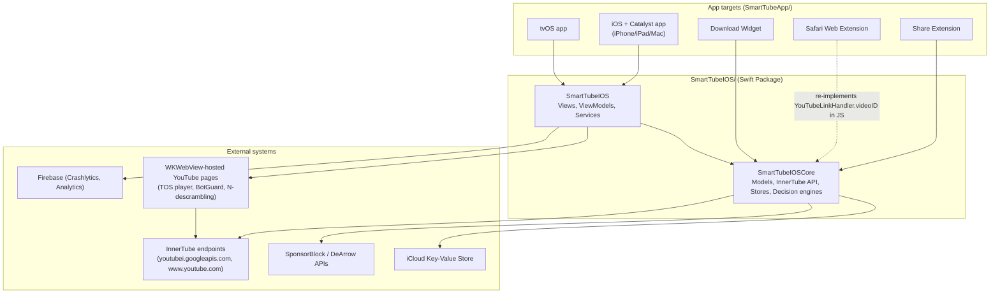

# Architecture overview

> How to update this doc: regenerate the module table's line counts with `just metrics`;
> update the target list whenever WS8 changes `Package.swift` targets. This doc describes
> the system as it is, not the target state — see `docs/modernization/PLAN.md` for that.

## Containers

Dependency direction: `SmartTubeIOSCore` must never import `SmartTubeIOS`, SwiftUI, UIKit, AVFoundation, or WebKit (declared in `Package.swift`, **not currently enforced** — see `docs/modernization/AUDIT.md` §2.1). App targets depend on the package; the package never depends on an app target.

## Modules

| Module / area | Directory | Owner workstream | Notes |
|---|---|---|---|
| `SmartTubeIOSCore` | `SmartTubeIOS/Sources/SmartTubeIOSCore/` | WS6 (core hardening), WS3 (tests) | Should be Foundation-only; currently imports SwiftUI/AVFoundation/JavaScriptCore/ActivityKit/Network too |
| `SmartTubeIOS` (views/view models/services) | `SmartTubeIOS/Sources/SmartTubeIOS/` | WS7 (UI/composition), WS4/WS5 (player) | |
| Playback (`PlaybackViewModel` + AVPlayer path) | `SmartTubeIOS/Sources/SmartTubeIOS/ViewModels/PlaybackViewModel*.swift` | WS4 (seams/pipeline), WS5 (session) | The critical path — see below |
| TOS player (WKWebView embed) | `SmartTubeIOS/Sources/SmartTubeIOS/Views/Player/TOSPlayer*.swift` | WS5 | Default player on iOS (ADR pending, WS2-T2.3) |
| Shorts embed player | `SmartTubeIOS/Sources/SmartTubeIOS/Views/Player/ShortsEmbed*.swift` | WS5 | |
| Stream resolution (JS extractors, descramblers) | `SmartTubeIOS/Sources/SmartTubeIOS/Services/YouTube*.swift`, `BotGuardWebViewRunner.swift` | WS4 | New `StreamResolver` target planned (WS8) |
| App targets, composition roots | `SmartTubeApp/Sources/`, `SmartTubeApp/Smart Tube/` | WS7, WS1 | |
| Tests | `SmartTubeIOS/Tests/`, `SmartTubeApp/UITests/` | WS3 | |
| Tooling / CI | repo root, `.github/`, `scripts/`, `justfile` | WS1 | |
| Docs / tasks | `docs/**`, `tasks/**` | WS2 | |

Full file-ownership-during-parallel-work table: `docs/modernization/PLAN.md` §4 (private repo, pending WS2-T2.6).

## Playback

The pipeline as it exists today (**legacy cascade** — pre-WS4; WS4 replaces the ordered-branch cascade with a `StreamSource`/`ResolutionPipeline` strangler fig, see `docs/modernization/workstreams/WS4-playback-seams-and-pipeline.md`):

1. A tap reaches `PlayerRouter.open` (`PlayerRouter.swift:41-48`) — the one clean routing seam in the whole subsystem.
2. `PlayerRouter` picks one of two branches:
   - **TOS branch** (default on iOS): `TOSPlayerViewModel` drives a WKWebView-hosted YouTube IFrame player.
   - **AVPlayer branch**: `PlayerStateStore` → `PlayerView.onAppear` → `PlaybackViewModel.load` → `loadAsync` → a primary iOS-client HLS attempt → `exhaustiveRetry` if that fails.
3. `exhaustiveRetry` (`PlaybackViewModel+Fallback.swift:88-528`, ~440 lines) tries stream methods in a hand-written, ordered cascade — roughly 20 branches across 13 named stream methods (`StreamMethodProbeSupport.knownMethods`) plus 6 unnamed ones (proxy-HLS, DASH composition, muxed itag-18, yt-dlp-style, n-descrambled, embed). One race of three paths runs concurrently; the 7-InnerTube-client list is written twice in different shapes (a `TaskGroup` and a serial loop) that must be kept in sync by hand.
4. Whichever path succeeds calls into the repeated-six-times `.readyToPlay` bookkeeping ritual (duration refresh, seek restore, load audio tracks, clear loading state, record timing) — one of the concrete duplication problems WS4 targets first.

Three players — AVPlayer, TOS, Shorts embed — each independently wire SponsorBlock, watch-history and Now Playing rather than sharing one interface; WS5 introduces `PlaybackSession` to unify them once WS4's seams exist.

Full evidence and line numbers: `docs/modernization/AUDIT.md` §2.2.

## Deep links

Four entry adapters converge on one point:

- Share Extension → `YouTubeLinkHandler.videoID`
- Siri Shortcuts
- Safari Web Extension (re-implements `YouTubeLinkHandler.videoID` in JavaScript, kept in sync by hand with a policing test — a duplication WS6 should resolve)
- Custom URL scheme

All four set `browseViewModel.deepLinkedVideo`, which `AppEntry`/`BrowseView` observes to open the player. There is no router; navigation state (`selectedVideo`, `selectedPlaylist`, `channelDestination`, `showSignIn`) is re-declared per-view in 6-7 places (WS7-T7.x introduces `AppRouter`).
